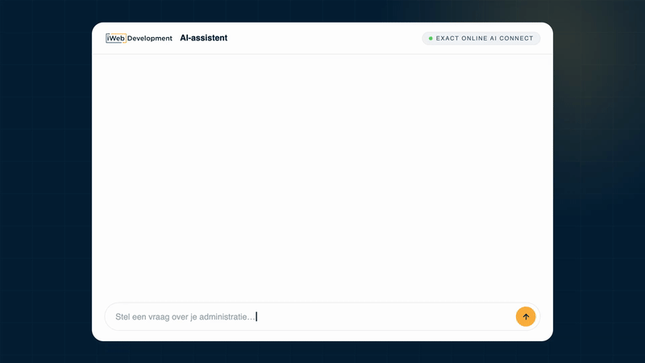

# Exact Online AI Connect


Exact Online AI Connect, by iWebDevelopment, is a hosted MCP server that connects your Exact Online administration to your AI assistant. Ask questions, pull reports, and prepare bookings for approval, right from the chat you already use.

Hosted at `https://mcp-exactonline.iwebdevelopment.com`. Authorize in your browser on first use, no tokens to paste into config.

**Get started in about 2 minutes.** See the [installation guide](https://www.iwebdevelopment.com/kennisbank/hoe-werkt-de-exact-online-ai-mcp-koppeling) to connect your administration.

[](https://cursor.com/install-mcp?name=exact-online&config=eyJ1cmwiOiJodHRwczovL21jcC1leGFjdG9ubGluZS5pd2ViZGV2ZWxvcG1lbnQuY29tIn0%3D) [](https://insiders.vscode.dev/redirect/mcp/install?name=exact-online&config=%7B%22name%22%3A%22exact-online%22%2C%22type%22%3A%22http%22%2C%22url%22%3A%22https%3A%2F%2Fmcp-exactonline.iwebdevelopment.com%22%7D)

Works with Claude on all plans (including the free plan); also with ChatGPT (Developer Mode, paid plans), Perplexity (Pro/Max/Enterprise), GitHub Copilot in VS Code, Cursor and other developer tools. Availability and setup differ per client. See the [client compatibility matrix](#client-compatibility) below.



## What you can do

- **Ask**: plain-language questions about your administration ("Wat heb ik klant X vorig kwartaal gefactureerd?").
- **Report**: outstanding items, aging, profit & loss, balance sheet.
- **Create & book with approval**: every write is a draft you review and approve first. Nothing posts to Exact Online without your confirmation.
- **Analyse**: large-dataset analysis and trend overviews, on the Analytics plan.

## Example prompts

- "Toon mijn tien recentste verkoopfacturen met het openstaande bedrag."
- "Welke debiteuren staan nog open en hoe lang?"
- "Wat heb ik klant X vorig kwartaal gefactureerd?"
- "Omzet per klant per maand dit jaar."
- "Kolommenbalans voor deze periode."
- "Maak een verkoopfactuur voor klant X (ter goedkeuring)."

## Install

### Add to Claude (web + Desktop)

1. Go to **Settings → Connectors → Add custom connector**.
2. Paste the base URL: `https://mcp-exactonline.iwebdevelopment.com`
3. Authorize with your Exact Online account.

On the free plan you can add one custom connector. On Team/Enterprise, an owner adds it org-wide.

For a legacy `mcp-remote` fallback, see `examples/claude-desktop-config.json` (optional, not required).

### Claude Code (plugin)

```
/plugin marketplace add iwebdevnl/exact-online-ai-connect
/plugin install exact-online@iwebdevnl-exact
/reload-plugins
/mcp
```

The last command signs you in.

Prefer to add it manually? `claude mcp add --transport http exact-online https://mcp-exactonline.iwebdevelopment.com`

### Other clients

Exact Online AI Connect is a standard remote MCP server, so most MCP-capable clients (ChatGPT, Perplexity, GitHub Copilot, Cursor, Cline, Windsurf, Zed, and others) can add it by URL. Setup steps and plan requirements vary per client, see the matrix below.

See the [full documentation](https://www.iwebdevelopment.com/kennisbank/hoe-werkt-de-exact-online-ai-mcp-koppeling) for per-client setup.

## Client compatibility

**Last verified: 2026-07**

| Client | Remote MCP? | Plan / mode | How to add |
|---|---|---|---|
| Claude (web / Desktop) | Yes, full read + write | All plans incl. **Free** (Free = 1 custom connector); Team/Ent = owner adds | Settings → Connectors → Add custom connector → base URL |
| Claude Code | Yes | Claude Code itself needs Pro/Max or API billing | `claude mcp add --transport http exact-online https://…`; OAuth in the browser |
| GitHub Copilot (VS Code) | Yes | All Copilot plans; Business/Enterprise need an admin "MCP servers" policy (off by default) | `.vscode/mcp.json` with `"type":"http"` + the server URL |
| Cursor | Yes | No documented plan gate | Settings → Tools & MCP → New MCP Server (`url`), or the Add-to-Cursor badge |
| Cline | Yes | Free (open-source) | mcp.json `"type":"streamableHttp"` (camelCase) |
| Windsurf | Yes | Enterprise may gate | Settings → Tools → Add Server (`serverUrl`) |
| Zed | Yes on recent builds (native HTTP since 2026-03); older builds via `mcp-remote` bridge | No documented gate | Settings → AI → MCP Servers (URL + Authorization header) |
| ChatGPT | Yes, **Developer Mode only** | **Paid** (Plus/Pro/Business/Enterprise/Edu), not Free | Settings → Connectors → Advanced → Developer mode → add the URL |
| Perplexity | Yes (since 2026-03) | **Paid** (Pro/Max/Enterprise), not Free, not in Comet | Add a custom remote connector by URL |
| Microsoft 365 Copilot | **No end-user "paste a URL"** | Agent path only (Copilot Studio) | Build/publish an agent (a heavier path) |

## Verify the connection

Once connected, try:

- "Toon mijn tien recentste verkoopfacturen met het openstaande bedrag."
- "Welke debiteuren staan deze week nog open?"

## Trust

- **ISO 27001** certified.
- Every write is a draft you approve, nothing books to Exact Online without your confirmation.
- Runs under your own Exact Online permissions.
- Data hosted in the EU.

See [TRUST.md](TRUST.md), [PRIVACY.md](PRIVACY.md), and [SECURITY.md](SECURITY.md) for details.

## Plans & limitations

- **Essentials**: day-to-day questions and processing, with approval on every write.
- **Analytics**: adds large-dataset analysis and trend overviews.
- **Free trial**: 30 days on the Analytics plan. After the trial, the integration stops unless a subscription is activated.

Not available (not exposed by the Exact Online API): closing periods (Afsluiten) and SEPA direct-debit batches.

## Support

Product page: https://www.iwebdevelopment.com/exact-online/ai-mcp-koppeling
