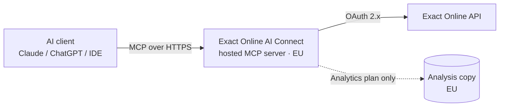

# How the connection works

You authorize access in your browser once (OAuth). No tokens are pasted into
your client config. Every write is prepared as a draft you approve before it is
posted. The authoritative terms are in iWeb's AV/DPA.
